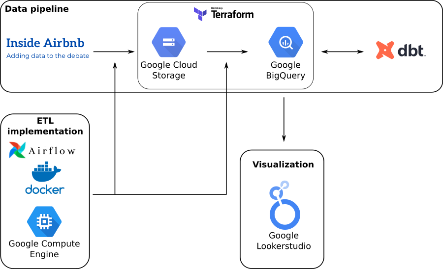
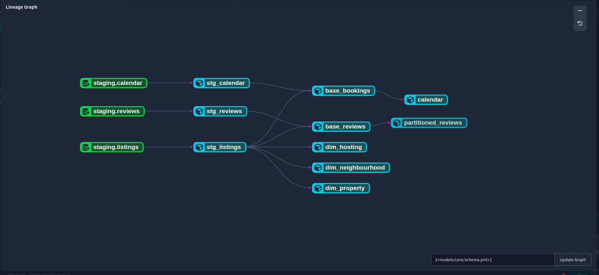
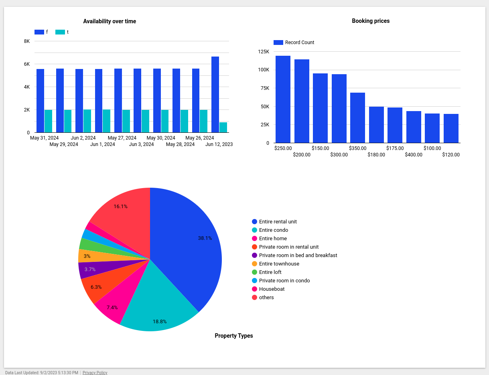

# Airbnb Data Engineering Project

A batch data pipeline that extracts, transforms and loads the [Airbnb Amsterdam](http://insideairbnb.com/amsterdam) into a Data Warehouse in the [Google Cloud Platform (GCP)](https://cloud.google.com/) and models the data in [Data build tool (dbt)](https://www.getdbt.com/).

## Project Description
Inside Airbnb is a mission driven project that provides data and advocacy about Airbnb's impact on residential communities.

We work towards a vision where data and information empower communities to understand, decide and control the role of renting residential homes to tourists.

This project has the goal of providing clarity in the following areas:

	1. Apartment availability over time.
	
	2. The range of booking prices.
	
	3. Type of structure available for booking.

## Project architecture

### How the data pipeline works

* Airflow:

    1. [Data Ingestion](./airflow): fetches data from the airbnb data site (Extract), process and arrange the columns (Transform), and loads the data into Google Cloud Storage (Load), then to BigQuery

* Dbt:

    1. [Data Modelling](./dbt/models): Used [Dbt](https://cloud.getdbt.com/) to model the data and transformations as well as model deployment

### Technologies

* [Terraform](https://www.terraform.io/) for managing and provisioning infrastructure (GCS bucket, Data Warehouse) in GCP.

* [Docker](https://www.docker.com/) for encapsulating the dataflows and their dependencies into containers, making it easier to deploy them.

* [Airflow](https://airflow.apache.org/) for dataflow implementation and workflow orchestration.

* [Data build tool (dbt)](https://www.getdbt.com/) for transforming, partitioning and clustering the dataset in the data warehouse.

* [Google Lookerstudio](https://lookerstudio.google.com/) for creating a dashboard to visualize the dataset.

## Results

### The dashboard is publicly available in this [link](https://lookerstudio.google.com/reporting/14047de8-6cbe-4571-a918-39cca328dcd7).

## Reproduce the project

[Follow detailed guide here](https://github.com/0xxhaisenberg/airbnb-amsterdam/blob/main/HOW-TO-RUN.md)
